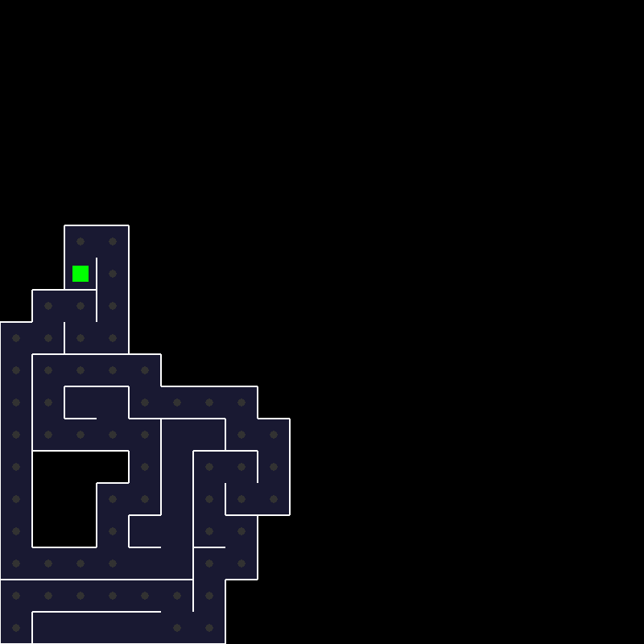
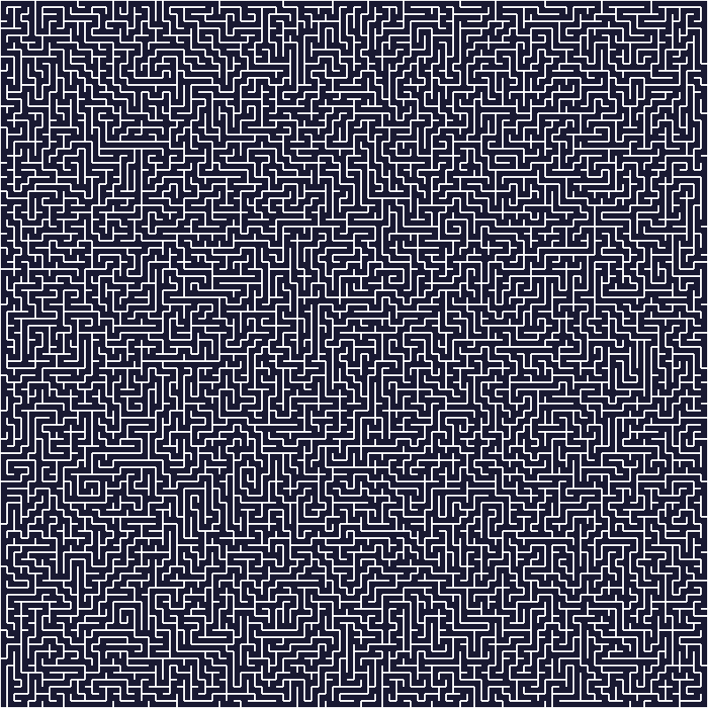

## Recursive Backtracker Maze Generator

Using [Randomized depth-first search](https://en.wikipedia.org/wiki/Maze_generation_algorithm#Recursive_implementation) to generate a maze with Pyglet in Python.
